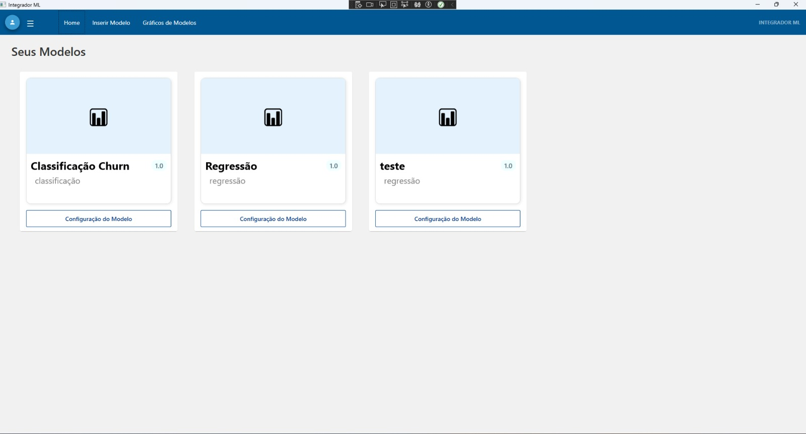
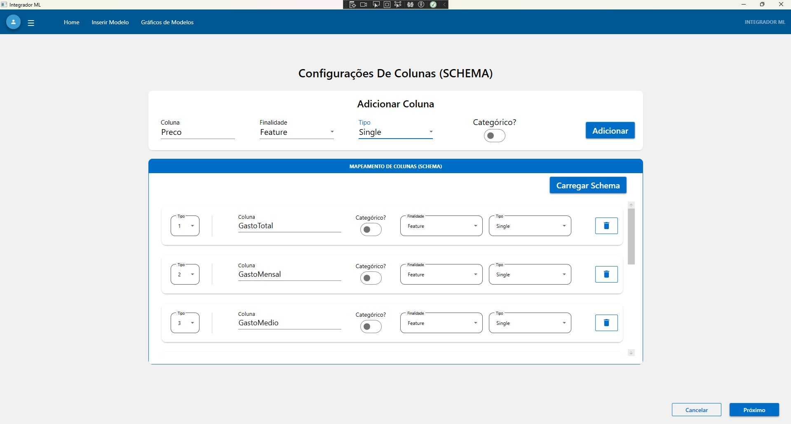
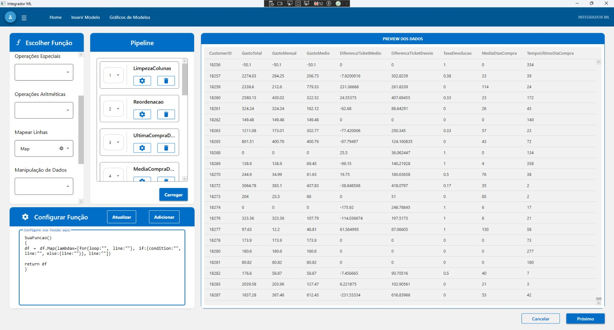
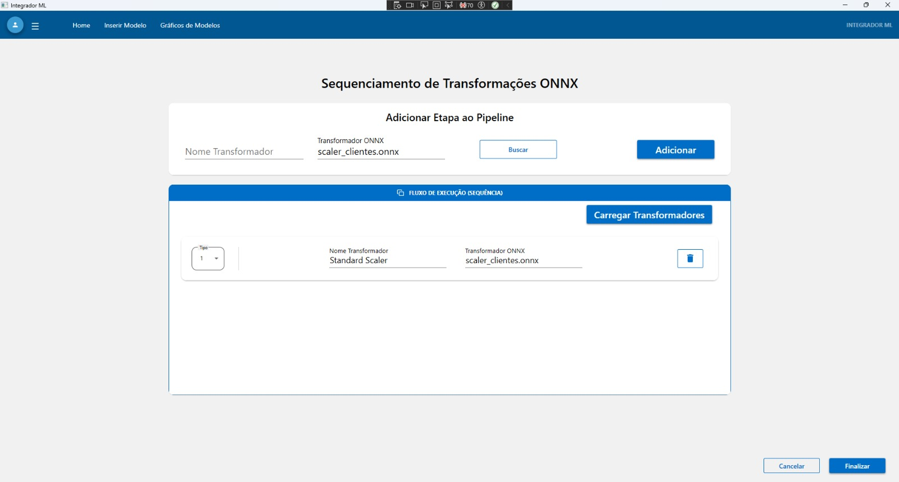
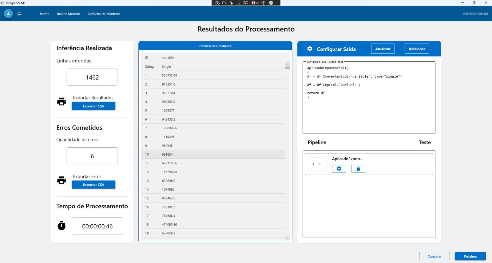
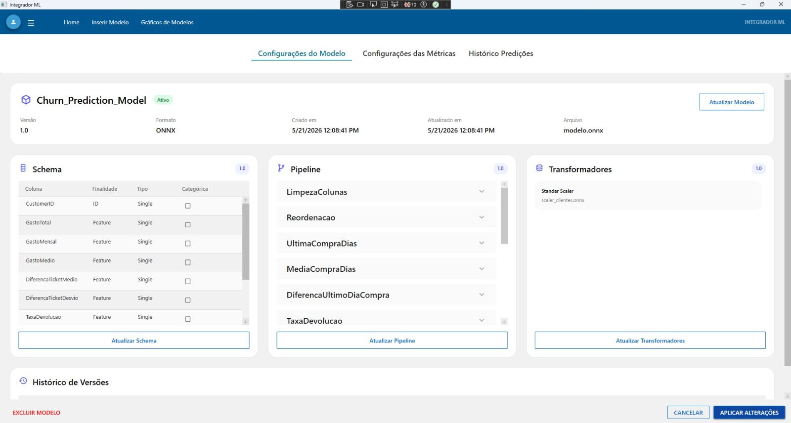

# 🚀 Integrador ML Engine

⚠️ Atenção: Este projeto é um protótipo funcional/POC (Proof of Concept) e pode apresentar alguns bugs pontuais ou falhar em determinadas funcionalidades que ainda estão incompletas (como botões ou páginas não implementados servindo apenas de ilustração ou conceito). No entanto, a estrutura arquitetural geral de inserção, configuração de modelos, pipelines e transformadores e inferências estão devidamente funcionais.

---

# 📖 Visão Geral

O **Integrador ML Engine** é uma aplicação desktop desenvolvida em **C#/.NET** para executar pipelines de preparação de dados e inferências de Machine Learning localmente.

O projeto foi criado para simplificar a implantação de modelos em aplicações desktop, permitindo distribuir toda a infraestrutura necessária para inferência sem depender de um ambiente Python instalado.

Além da execução dos modelos, o sistema gerencia automaticamente **schemas**, **pipelines**, **transformadores** e demais artefatos necessários para a inferência, persistindo essas configurações em arquivos **JSON**. Dessa forma, novos modelos podem ser adicionados ou atualizados sem necessidade de recompilar a aplicação.

---

# 📸 Demonstração

<div align="center">




</div>

<div align="center">




</div>

<div align="center">
  



</div>

---

# 🏗️ Arquitetura

A solução foi desenvolvida seguindo os princípios de **Clean Architecture** e **Domain-Driven Design (DDD)**.

A camada de domínio concentra toda a lógica de processamento de dados, enquanto a camada de aplicação é responsável pela construção dos pipelines, gerenciamento dos modelos e comunicação com a interface WPF.

---

# ⚙️ Fluxo de Execução

O processamento ocorre em sete etapas principais.

## 📥 1. Ingestão dos Dados

Arquivos CSV e TSV são processados utilizando `StreamReader`, realizando durante a leitura o tratamento de delimitadores, aspas e conversões numéricas.

---

## 📊 2. DataFrame

Os dados são carregados em um **DataFrame colunar desenvolvido em C#**, utilizando colunas fortemente tipadas para facilitar o processamento e reduzir conversões desnecessárias.

---

## ✅ 3. Validação do Schema

Antes da execução do pipeline, o sistema verifica automaticamente se os dados recebidos são compatíveis com o modelo configurado.

São validados:

- Nome das colunas
- Tipos dos dados
- Ordem das colunas
- Requisitos definidos pelo modelo

---

## 🌳 4. Construção do Pipeline

Os pipelines são descritos por uma **DSL (Domain Specific Language)** própria.

O código é convertido para uma **Abstract Syntax Tree (AST)** e, posteriormente, transformado em uma sequência de executores especializados, responsáveis pelas operações sobre o DataFrame.

Essa arquitetura permite adicionar novas operações ao pipeline sem alterar seu mecanismo de execução.

---

## ⚡ 5. Feature Engineering Dinâmico

Operações de engenharia de atributos que exigem lógica personalizada são tratadas de forma diferente das transformações convencionais.

Nesses casos, o sistema gera funções em **tempo de execução** utilizando **Expression Trees**.

Em vez de interpretar a expressão para cada linha do DataFrame, essas funções são compiladas dinamicamente e reutilizadas durante toda a execução, permitindo criar operações de Feature Engineering complexas sem recompilar a aplicação.

---

## 🤖 6. Inferência

Após o pré-processamento, os dados são enviados ao runtime de inferência.

Atualmente a aplicação suporta modelos executados através de:

- ONNX Runtime
- ML.NET

---

## 📤 7. Pós-processamento

Os resultados são exportados juntamente com relatórios de inconsistências.

Caso alguma linha apresente erro durante a inferência, ela é registrada separadamente, permitindo que o restante do lote continue sendo processado normalmente.

---

# 🧠 Construção dos Pipelines

O mecanismo de execução é dividido em quatro etapas principais:

1. A **DSL** descreve as operações desejadas.
2. O **Parser** converte o código para uma **AST**.
3. O **Builder** cria dinamicamente uma sequência de executores especializados.
4. Os executores processam o DataFrame de forma sequencial.

As operações de **Feature Engineering** utilizam **Expression Trees** para gerar funções compiladas em tempo de execução, permitindo criar transformações personalizadas sem recompilar a aplicação.

---

# 💾 Persistência dos Modelos

Toda a configuração necessária para executar um modelo é persistida em arquivos **JSON**, armazenados automaticamente no diretório da aplicação.

Entre os artefatos persistidos estão:

- Schema do modelo
- Pipeline de pré-processamento
- Pipeline de pós-processamento
- Transformadores
- Modelo em uso
- Configurações de inferência

Essa abordagem desacopla completamente a lógica da aplicação das configurações do modelo, facilitando manutenção, atualização e versionamento.

---

# 📜 Como Funciona a DSL

O Integrador ML Engine possui uma **Domain-Specific Language (DSL)** própria para definição de pipelines de preparação de dados. Inspirada em bibliotecas como **Pandas** e **PySpark**, a linguagem permite descrever operações de limpeza, transformação e engenharia de atributos utilizando uma sintaxe fluente.

Cada função recebe um **DataFrame**, executa uma sequência de transformações e retorna um novo estado do conjunto de dados.

```csharp
LimpezaColunas()
{
df = df.DropNa()
df = df.DropDuplicates()

return df
}
```

Internamente, o código da DSL é convertido em uma **Abstract Syntax Tree (AST)**. A partir dessa representação, o engine constrói dinamicamente uma sequência de executores especializados responsáveis por cada operação do pipeline.

As operações de **Feature Engineering** utilizam **Expression Trees** para gerar funções compiladas em tempo de execução, permitindo executar transformações personalizadas diretamente sobre o DataFrame sem recompilar a aplicação.

Ela suporta:

- Conversão de tipos
- Limpeza
- Agregações
- Merge
- Operações matemáticas
- Feature Engineering

---

# ✨ Principais Características

- 📊 DataFrame colunar desenvolvido em C#
- 📝 DSL própria para definição de pipelines
- 🌳 Parser responsável por converter a DSL em uma AST
- ⚙️ Construção dinâmica de executores especializados
- ⚡ Feature Engineering compilado em tempo de execução utilizando Expression Trees
- 💾 Persistência completa das configurações em JSON
- 🤖 Execução local de modelos ONNX Runtime e ML.NET
- 📦 Processamento em lote com isolamento de erros
- 🧱 Arquitetura baseada em Clean Architecture e Domain-Driven Design (DDD)

---

# 🛠️ Tecnologias

| Categoria | Tecnologias |
|-----------|-------------|
| Linguagem | C# |
| Framework | .NET |
| Interface | WPF |
| Inferência | ONNX Runtime, ML.NET |
| Serialização | System.Text.Json |
| Mapeamento | AutoMapper |
| Compilação Dinâmica | Expression Trees |
| Manipulação de Dados | StreamReader, Span\<T\> |

---

# 📁 Estrutura do Projeto

```text
IntegradorAplicacao
│
├── Aplicacao
├── DTO
├── Infraestrutura
└── InjecaoDependencia.cs

IntegradorDominio
│
├── AST
├── Attributes
├── FeatureEngineering
├── InterfacesSteps
└──  Models
  ├── Configuracao
  ├── DataFrameModel
  └── Inferencia

IntegradorTesteUnidade
│
├── AplicacaoTestes
├── DominioTestes
└── ViewModelTestes

IntegradorView
│
├── ControleUsuario
├── InteracoesUI
├── Pages
├── Resources
├── App.xaml
└── MainWindow.xaml

IntegradorViewModel
│
├── ControleUsuario
├── ItensViewModel
├── JanelaModelo
├── Pages
└── Shared
```
---

# 📌 Diferenciais

- Execução local de modelos de Machine Learning sem ambiente Python.
- DataFrame desenvolvido especificamente para o projeto.
- DSL própria para definição de pipelines.
- Conversão da DSL em AST para construção dinâmica do pipeline.
- Feature Engineering compilado em tempo de execução utilizando Expression Trees.
- Persistência completa dos artefatos de Machine Learning através de arquivos JSON.
- Arquitetura baseada em Clean Architecture e Domain-Driven Design (DDD).
- Estrutura preparada para distribuição e atualização de modelos sem recompilação.
